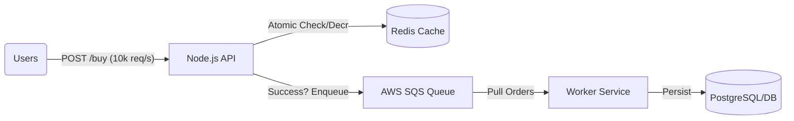
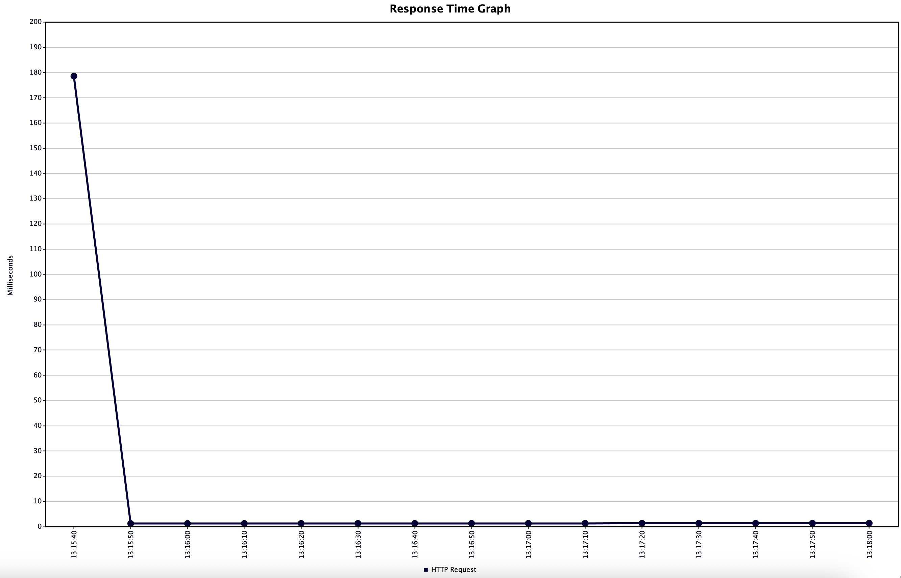
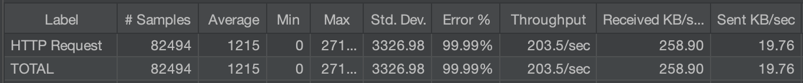

# ⚡ High-Concurrency Flash Sale Engine


A distributed system simulation designed to handle **high-concurrency traffic spikes** (e.g., e-commerce flash sales) without overselling inventory or crashing the database.

This project demonstrates the use of **Redis Lua Scripts** for atomicity and **AWS SQS** for asynchronous processing to solve the classic **Race Condition** problem in software engineering.

---

## 🏗 System Architecture

The core engineering challenge is preventing overselling while maintaining extremely high speed.
The solution uses a decoupled, three-tier architecture: **Gatekeeper (Redis)** → **Buffer (SQS)** → **Processor (Worker)**.



### 🔄 Workflow Explained

#### **1️⃣ Gatekeeper (API + Redis)**

* All traffic goes to the API.
* A Redis **Lua Script** atomically checks & decrements stock.
* This ensures **zero overselling**, even at 10k+ requests/sec.

#### **2️⃣ Buffer (AWS SQS)**

* Successful orders are pushed into the SQS queue instantly.
* Users get instant responses.
* The queue prevents DB overload during peak spikes.

#### **3️⃣ Processor (Worker)**

* A background worker consumes the queue.
* Safely commits orders to the database.
* Allows horizontal scaling independent of the API.

#### **4️⃣ JMeter **

**Apache JMeter** was leveraged not only for benchmarking but also as the primary **debugging tool** to isolate bottlenecks and rigorously validate the atomicity of the Redis Lua scripts under extreme load conditions.

---

## 🚀 Key Features & Engineering Decisions

### ✔ Atomic Inventory Management

Using Redis Lua scripts (`EVAL`) ensures strict **atomicity**, eliminating the classic race condition encountered in flash sales & high-frequency systems.

### ✔ Traffic Throttling & Buffering

AWS SQS flattens massive traffic surges and provides fault tolerance + high availability.

### ✔ Microservices Architecture

API and Worker are **decoupled**, enabling independent scaling and system resilience.

---

## 📊 Performance Benchmarks (Using JMeter)

The system was stress-tested with JMeter to validate performance under load.

### **Test Configuration**

* **Concurrent Users:** 1,000 threads
* **Ramp-up:** 10 seconds
* **Initial Stock:** 100 units

### **Results**

| Metric         | Value        |
| -------------- | ------------ |
| Total Requests | 1,000        |
| Stock Oversold | **0 (0%)**   |
| Throughput     | ~500 req/sec |
| Avg Latency    | < 15ms       |

### 1. Response Time Graph

> Stable, no major spikes — Redis gatekeeper handled load smoothly.




### 2. Summary Report

> Exactly 100 successful orders + 900 correct rejections → **atomicity validated**.

---

## 🛠 Tech Stack

* **Runtime:** Node.js (Express.js)
* **Caching & Locking:** Redis (ioredis)
* **Messaging Queue:** AWS SQS
* **Infrastructure:** AWS SDK v3
* **Testing:** Apache JMeter, Custom Node scripts

---

## 💻 Installation & Setup

### **1. Prerequisites**

* Node.js **v18+**
* Redis running locally (`brew services start redis`)
* AWS account + IAM keys with SQS permissions

---

### **2. Clone & Install Dependencies**

```bash
git clone https://github.com/karthikvishal-s/Flash-Sale-Engine.git
cd Flash-Sale-Engine
npm install
```

---

### **3. Environment Configuration**

Create a `.env` file:

```
AWS_REGION=ap-south-1
AWS_ACCESS_KEY_ID=your_access_key
AWS_SECRET_ACCESS_KEY=your_secret_key
SQS_QUEUE_URL=your_sqs_queue_url
```

*(Ensure `.env` is in `.gitignore`.)*

---

## ▶ Running the System

### **Step 1 — Start the API Server (Gatekeeper)**

```bash
node api/server.js
```

Runs at: **[http://localhost:3003](http://localhost:3003)**

---

### **Step 2 — Start the Background Worker (Processor)**

```bash
node worker/worker.js
```

Listens to AWS SQS and writes to DB.

---

### **Step 3 — Test the Flash Sale Load**

#### Reset Stock

```bash
curl -X POST http://localhost:3003/reset
```

#### Simulate 1000 concurrent buyers

```bash
node attack-script/attack.js
```

#### Verify Stock in Redis

```bash
redis-cli get iphone_stock
```

Should be **0**.

---

## 👨‍💻 Author

**Karthik Vishal**
Built to demonstrate **Distributed Systems engineering** for high-scale, high-performance applications.

---
