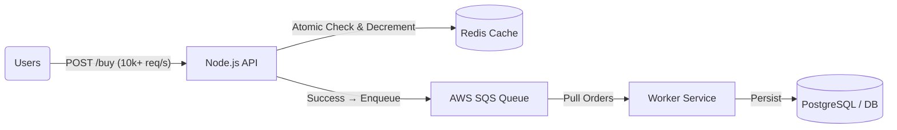
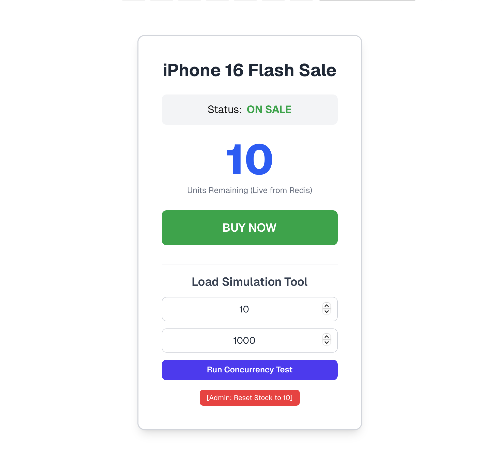
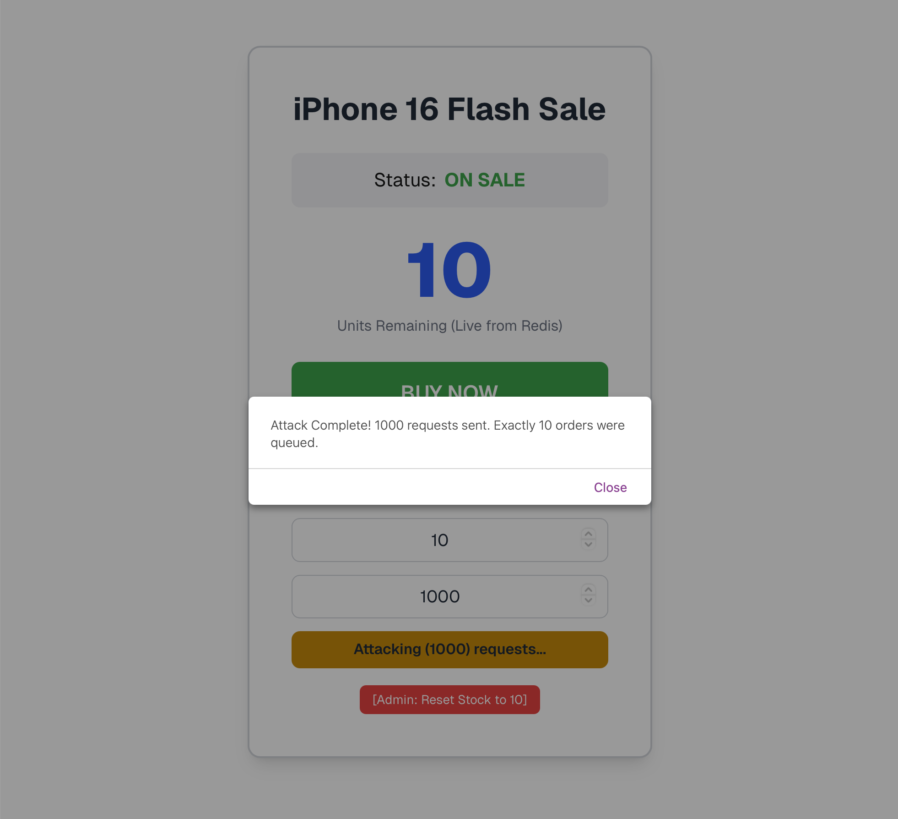
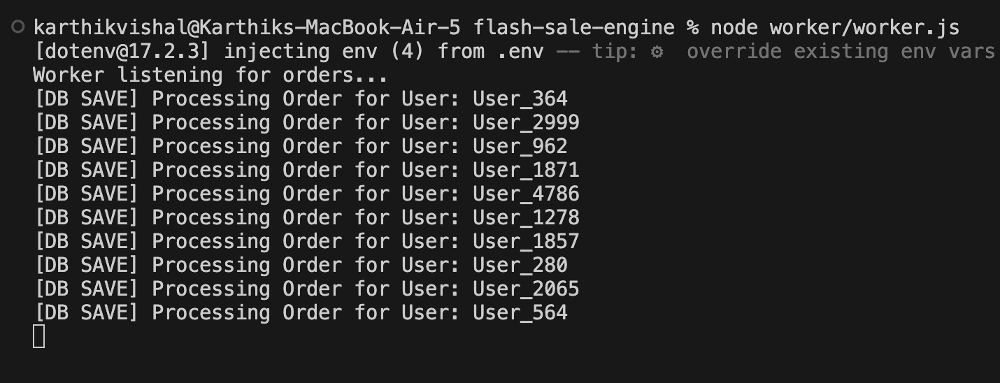

# ⚡ High-Concurrency Flash Sale Engine


A **production-grade distributed system** designed to handle extreme **high-concurrency flash sale traffic** without overselling inventory or overwhelming the database. This project serves as a **case study in scalable backend architecture**, focusing on correctness, resilience, and performance under load.

The system guarantees **zero oversells** by combining **Redis atomic locking** with **asynchronous buffering via AWS SQS**, ensuring data integrity even under massive traffic spikes.

---

## 🏗 System Architecture — Three-Tier Decoupling

The core engineering solution is a **decoupled, three-tier architecture**:

**Gatekeeper (Redis)** → **Buffer (SQS)** → **Processor (Worker)**

This design ensures instant user feedback, protects the database, and prevents race conditions.



---

## 🔄 Architecture Breakdown

| Layer              | Component             | Technology         | Problem Solved                                                                                                       |
| ------------------ | --------------------- | ------------------ | -------------------------------------------------------------------------------------------------------------------- |
| **1️⃣ Gatekeeper** | Atomic Inventory Lock | Redis + Lua Script | Prevents race conditions by making stock check & decrement a single atomic operation — **guarantees zero oversells** |
| **2️⃣ Buffer**     | Asynchronous Queue    | AWS SQS            | Absorbs traffic spikes and protects the database from overload                                                       |
| **3️⃣ Processor**  | Background Worker     | Node.js Worker     | Safely persists orders with **idempotency checks** to prevent double-processing                                      |

---

## ✨ Concurrency Simulation Dashboard (Next.js)

The project includes a **Next.js frontend dashboard** that replaces traditional load-testing tools like JMeter by enabling **live concurrency simulations directly from the UI**.

### Features

* **Live Stock Polling**
  Displays real-time inventory fetched from Redis via the API.

* **Custom Load Testing**
  Dynamically configure:

  * Concurrent requests (100–5000)
  * Available stock (winners)

* **Optimistic UI**
  The **BUY NOW** button immediately updates the UI for ultra-low perceived latency.

---

## Results

### 1. FrontPage

> Before and after invoking the race condition




### 2. Worker Terminal

> Exactly 10 successful orders logged in worker terminal after dequeueing from AWS SQS.


### 3. Response Time Graph

> Stable, no major spikes — Redis gatekeeper handled load smoothly.


### 4. Summary Report

> Exactly 10 successful orders + 82000+ correct rejections → **atomicity validated**.

---


## 🚀 Key Engineering Decisions

* **Atomic Locking**
  Redis Lua scripts (`EVAL`) ensure stock validation and decrement happen as one unbreakable operation.

* **System Decoupling**
  API handles fast ingestion, workers handle slow persistence — both scale independently.

* **Idempotent Processing**
  Worker logic prevents duplicate order writes when SQS retries messages.

* **Professional Load Validation**
  Apache JMeter was used during development to rigorously validate **zero-oversell behavior** under simulated DDoS-scale traffic.

---

## 💻 Installation & Setup

### 1️⃣ Prerequisites

* Node.js **v18+**
* Redis running locally

  ```bash
  brew services start redis
  ```
* AWS account with **SQS permissions**
* Tailwind CSS (used in frontend)

---

### 2️⃣ Environment Configuration

Create a `.env` file in the project root:

```env
AWS_REGION=ap-south-1
AWS_ACCESS_KEY_ID=your_access_key
AWS_SECRET_ACCESS_KEY=your_secret_key
SQS_QUEUE_URL=your_sqs_queue_url
```

---

### 3️⃣ Installation

Clone the repository and install dependencies:

```bash
git clone https://github.com/karthikvishal-s/Flash-Sale-Engine.git
cd Flash-Sale-Engine

# Backend dependencies (API + Worker)
npm install

# Frontend dependencies
cd client
npm install
```

---

## ▶ Running the System

Run each component in a **separate terminal**:

| Terminal | Component                  | Command                    | Output                                         |
| -------- | -------------------------- | -------------------------- | ---------------------------------------------- |
| #1       | Backend API (Gatekeeper)   | `node api/server.js`       | [http://localhost:3003](http://localhost:3003) |
| #2       | Worker Service (Processor) | `node worker/worker.js`    | Logs `[DB SAVE]` on order persistence          |
| #3       | Frontend Dashboard         | `cd client && npm run dev` | [http://localhost:3005](http://localhost:3005) |

---

## 🧪 How to Run the Concurrency Test

1. Open **[http://localhost:3005](http://localhost:3005)** in your browser
2. In **Load Simulation Tool**:

   * Set **Available Stock** → `5`
   * Set **Load Size** → `500`
3. Click **Run Concurrency Test**

### Expected Results

* UI stock counter instantly drops to **0**
* Worker logs **exactly 5 `[DB SAVE]` messages**
* **Zero oversells confirmed** ✅

---

## 👤 Author

**Karthik Vishal**

Built to demonstrate **distributed systems engineering**, **high-concurrency handling**, and **real-world backend scalability patterns**.

---
\
